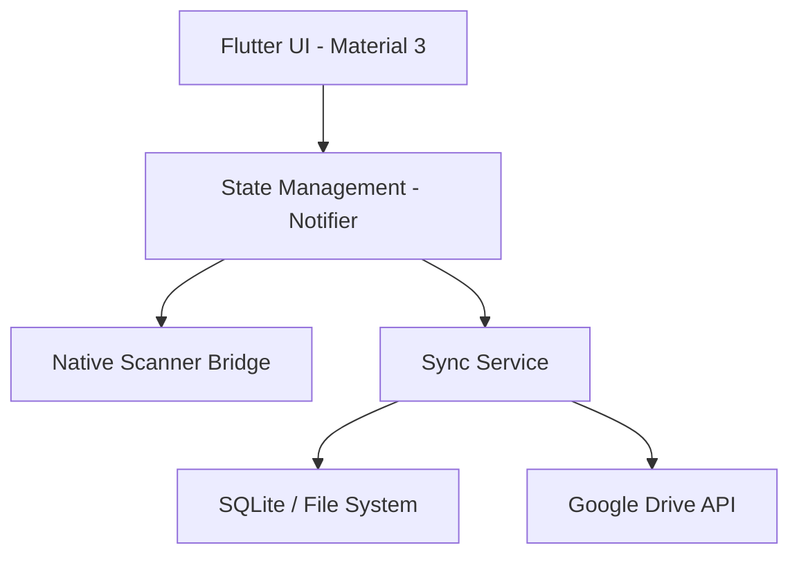

# Design Document: APT Doc Scanner

## Overview
APT Doc Scanner is a mobile application for iOS and Android designed to digitize physical documents using native machine learning capabilities. It provides a seamless "Scan-to-Cloud" experience, integrating with Google Drive for persistent storage and cross-device synchronization.

## Goal & Problem Analysis
Users need a fast, reliable way to scan documents and ensure they are backed up safely. 
Key requirements include:
- High-quality document scanning with edge detection and perspective correction.
- Automated synchronization between local device storage and Google Drive.
- A modern, interactive UI with fluid animations to enhance user experience.
- Profile management for user-specific settings and account information.

## Alternatives Considered
### Scanning Engine
1. **Custom OpenCV Implementation:** Highly flexible but requires significant development effort for edge detection and perspective correction.
2. **`google_mlkit_document_scanner`:** Official and performant, but currently Android-only.
3. **`flutter_doc_scanner` (Selected):** A unified bridge that uses Google's ML Kit on Android and Apple's VisionKit on iOS. This provides the best native experience on both platforms with minimal binary size overhead.

### Storage & Sync
1. **Firebase Storage:** Easier to set up but less accessible for users who want to see their files in their own Google Drive.
2. **Google Drive API (Selected):** Direct integration allows users to own their data. Using `appDataFolder` ensures app-specific data is kept separate from general Drive files.

## Detailed Design

### Architecture
The app follows a **Feature-based Clean Architecture** pattern:
- **Presentation Layer:** Flutter widgets and Bloc/Notifier for state management.
- **Domain Layer:** Business logic and repository interfaces.
- **Data Layer:** Implementation of repositories, local database (SQLite), and remote API (Google Drive).

### Component Diagram

### Data Flow
1. **Scan:** User triggers scan -> Native UI opens -> Result returned as JPEG/PDF.
2. **Save:** File saved to `path_provider` directory -> Metadata stored in SQLite.
3. **Sync:** Sync Service detects new/updated file -> Authenticates via Google Sign-In -> Uploads to `appDataFolder` on Google Drive.

### UI/UX Design
- **Theme:** Material 3 with a custom seed color.
- **Motion:** Use `animations` package for shared element transitions (Hero) and `AnimatedList` for document views.
- **Interactive:** Haptic feedback on capture and real-time upload progress indicators.

## Summary
APT Doc Scanner leverages native platform capabilities (ML Kit and VisionKit) to provide a professional scanning experience. By integrating Google Drive, it ensures data longevity and accessibility, all wrapped in a modern Flutter-based interface.

## References
- [Google ML Kit Document Scanner](https://developers.google.com/ml-kit/vision/doc-scanner)
- [Apple VisionKit](https://developer.apple.com/documentation/visionkit)
- [Google Drive API v3](https://developers.google.com/drive/api/v3/about-sdk)
- [Flutter Animations Package](https://pub.dev/packages/animations)
